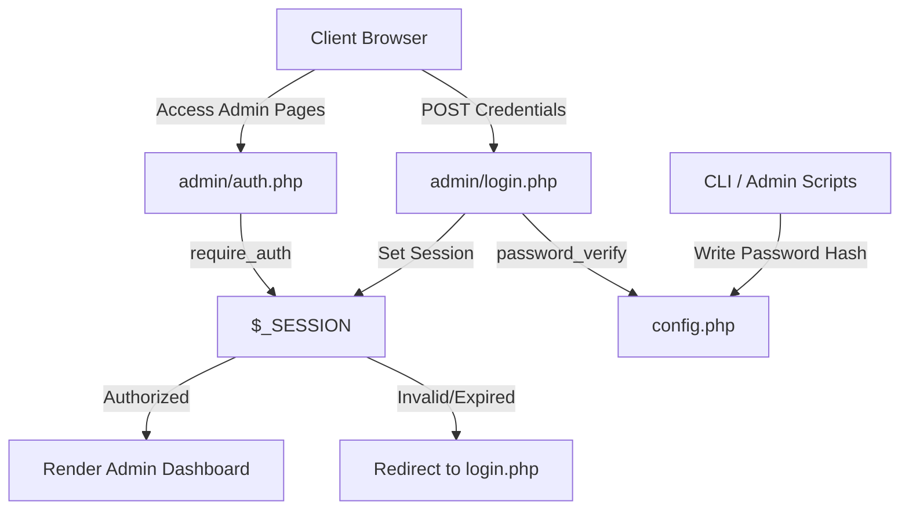

# Developer Spec: Authentication & Credentials Subsystem

This document provides a high-density reference of the **Course Explorer Admin Authentication System** for core developers. It defines the session lifecycle, password cryptography, storage constraints, and command-line updates.

---

## 1. System Architecture

The authentication subsystem is a lightweight, zero-dependency, session-based file-driven mechanism. It does not require a database server, instead relying on localized configuration variables and PHP session states.



---

## 2. Component Directory & File Responsibilities

| File Path | Description | Access Profile |
| :--- | :--- | :--- |
| [config.php](file:///d:/Dev/_PLUGIN-DEV/simple-course-explorer/config.php) | Houses the serialized crypt hash array for administrative access. | Read/Write (CLI Only); Blocked from Web access via `.htaccess`. |
| [admin/auth.php](file:///d:/Dev/_PLUGIN-DEV/simple-course-explorer/admin/auth.php) | Initializes administrative session checks and includes the `require_auth()` guard. | Internal PHP execution only. |
| [admin/login.php](file:///d:/Dev/_PLUGIN-DEV/simple-course-explorer/admin/login.php) | Validates POST inputs against the configuration crypt hash and issues cookies. | Public Web access allowed. |
| [dev/admin_scripts/update_password.php](file:///d:/Dev/_PLUGIN-DEV/simple-course-explorer/dev/admin_scripts/update_password.php) | CLI utility to input, confirm, hash, and store passwords to the filesystem. | CLI/Terminal execution only. |

---

## 3. Cryptography & Storage Schema

### Password Hashing
Password hashes are generated using the standard PHP `password_hash()` library with the `PASSWORD_DEFAULT` algorithm (currently mapping to bcrypt). 
- **Bcrypt Work Factor / Cost:** Inherits system default (typically `10` or `12`).
- **Storage Profile:** Config files return a standard PHP key-value array mapping `'admin_password'` to the crypt string:
  ```php
  <?php
  // Admin configuration
  return [
      'admin_password' => '$2y$12$yYI3cGjLowkyZxa4ipVzGe4t94EiQkekEsDYWxzLG0nC8PYoA/Dse',
  ];
  ```

---

## 4. Authentication Flow

### Session Guard Initialization (`admin/auth.php`)
Every administrative entry point requires `auth.php` and executes `require_auth()` before rendering HTML.
```php
if (session_status() === PHP_SESSION_NONE) {
    session_start();
}
// Loads configuration or halts execution if not initialized
$config = require dirname(__DIR__) . '/config.php';

function require_auth() {
    if (!isset($_SESSION['admin_logged_in']) || $_SESSION['admin_logged_in'] !== true) {
        header('Location: /admin/login.php');
        exit;
    }
}
```

### Credentials Validation (`admin/login.php`)
1. Checks for active session variables to prevent double-authentication.
2. Intercepts POST parameters on form submit.
3. Employs `password_verify($input, $configHash)` to prevent timing attacks.
4. Generates session ID and populates `$_SESSION['admin_logged_in']` with `true`.
5. Performs location redirects.

---

## 5. Security & Isolation Constraints

### Access Control Filters (`.htaccess`)
Direct HTTP requests targeting backend configuration files or administration scripts are locked down using standard Apache directive rules:
```apache
# Block configuration and specs folders from public access
RedirectMatch 404 ^/config\.php$
RedirectMatch 404 ^/dev/
```

### Script Execution Isolation
Password modification tools are kept isolated within `/dev/admin_scripts/` to keep the project root clean and prevent accidental invocation.
- `update_password.php` enforces CLI-only environments:
  ```php
  if (php_sapi_name() !== 'cli') {
      die("This script must be run from the command line.\n");
  }
  ```

### Windows Shell Input Protection
When running on Windows CLI, the password setup utility attempts a secure shell input using PowerShell secure string capture, falling back to traditional text streams only if no TTY interface is present:
```powershell
powershell -NoProfile -Command "$p = Read-Host -AsSecureString; [Runtime.InteropServices.Marshal]::PtrToStringAuto([Runtime.InteropServices.Marshal]::SecureStringToBSTR($p))"
```

---

Copyright (c) 2026:
vatofichor - Sebastian Mass     [>_<]
& Assisted By Gemini Antigravity \|\
