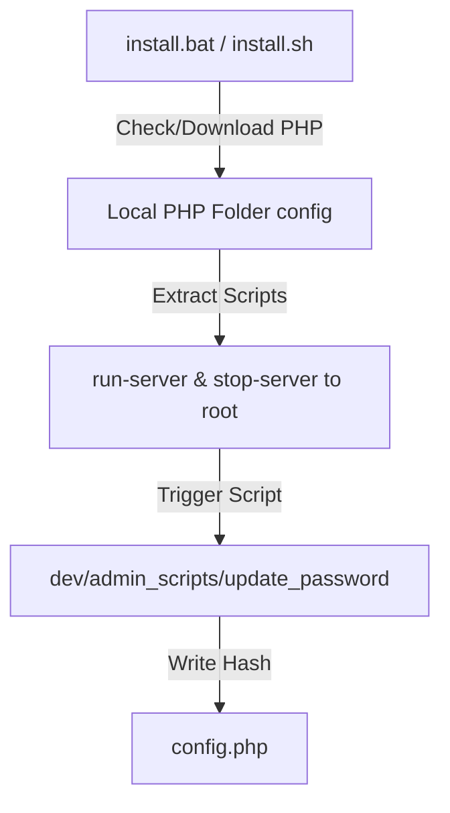

# Setup & Installation Specification

This specification governs the setup, local execution, and production server deployment profiles for the Course Explorer. It establishes the folder organization, installer lifecycles, and build-time exclusion criteria for target environments.

---

## 1. Directory & Environment Overview
The project layout segregates student-facing elements, admin panels, raw content sources, and portable desktop execution tooling:

- `/public/`: The student-facing root (contains `index.php`, `content/`, and `res/`).
- `/admin/`: Instructor dashboard, login, section creator, page creator, and editor interfaces.
- `/content_source/`: Source repository of raw Markdown documents (`.md`).
- `/dev/`: Developer setups, commands, specs, and compile-time CLI tools.
- `/lib/`: Shared core libraries (such as the JS compiler `md2web.js`).

---

## 2. Desktop Native Mode (Local Portable Setup)
Desktop Native Mode facilitates offline reading and content creation without requiring global PHP or Node.js installations on the client machine.

### A. Execution Lifecycle

### B. Installation Mechanics (`install.bat` / `install.sh`)
1. **PHP Binary Detection:**
   - Checks if a portable local PHP environment is already present inside `./php/php.exe`.
   - If missing, checks for system-wide PHP in the environment `PATH`.
   - If no PHP exists, downloads the official portable Windows PHP zip archive (approx. 32MB) over HTTPS, unpacks it into the `./php/` directory, and performs cleanup.
2. **Startup Script Unpacking:**
   - Unpacks the local development server scripts `run-server.bat` / `run-server.sh` from `public/res/lib/` directly into the project root.
3. **Security Setup:**
   - Launches the command-line password configurator (`dev/admin_scripts/update_password.php`), prompts for an admin password, hashes it using `password_hash()`, and writes it to `config.php`.

### C. Server Control
- **Starting Server:** Launching `run-server.bat` / `run-server.sh` fires the local PHP SAPI server on `http://localhost:8000` with OPCache disabled for real-time development (`-d opcache.enable=0 -S localhost:8000`). It automatically spawns a browser window.
- **Stopping Server:** Executed via command-line interrupts (`Ctrl+C`) or using standard task termination scripts inside `dev/admin_scripts/`.

---

## 3. Server Mode (Production LAMP / WAMP Stack)
Production Server Mode is designed for public hosting (e.g., standard Apache, Nginx, or IIS web servers) where content is pre-rendered and served statically to students, with the admin dashboard either locked down or completely stripped.

### A. Build Profiles & File Exclusions
To optimize security and performance on public servers, specific folders and files must be excluded from public builds. Use `.pbackup` or manual zip filters to target the following profiles:

| Directory/File | Desktop Native Mode | Production Server Mode | Rationale |
| :--- | :---: | :---: | :--- |
| `/public/` | **Present** | **Present** | Main student interface and compiled assets. |
| `config.php` | **Present** | **Present** | Stores hashed admin password (blocked by `.htaccess`). |
| `/admin/` | **Present** | *Optional* | Content editor. Omit if publishing static content only. |
| `/content_source/` | **Present** | *Optional* | Raw markdown source. Omit if publishing static content only. |
| `/dev/` | **Present** | **Exclude** | CLI builders, password tools, and local configuration logs. |
| `/.dev/` | **Present** | **Exclude** | Local developer archives, templates, and raw specs. |
| `/php/` | **Present** | **Exclude** | Local PHP interpreter binary. |
| `install.bat / .sh` | **Present** | **Exclude** | Local installer setup scripts. |
| `uninstall.bat / .sh` | **Present** | **Exclude** | Local uninstaller cleanup scripts. |
| `run-server.bat / .sh` | **Present** | **Exclude** | Local desktop development runners. |

### B. Directory Hardening via Access Rules (`.htaccess`)
A mandatory `.htaccess` configuration blocks direct web access to sensitive directories and configuration files:
- **Direct Block rules (`RedirectMatch 403`):** Protects `/content_source/`, `/dev/`, `/.dev/`, `/ai_persistent_files/`, and backups.
- **File Access Prevention (`Files` directive):** Blocks external requests targeting `config.php` or script files (`.bat`, `.sh`, `.workspace`, `.zip`).

---

## 4. Compilation & Deployment Workflow (Option B Paradigm)
1. **Authoring:** Instructors add sections and edit pages within the admin web panel (`/admin/dashboard.php`). Content changes are saved directly as `.md` documents inside `/content_source/`.
2. **Compilation:** The admin editor triggers the CLI compiler `dev/admin_scripts/convert.php` in the background. The compiler invokes `lib/md2web-plugin/md2web.js` via the local JScript host (`cscript`) or Node.js.
3. **HTML Rendering:** The compiler parses Markdown, generates clean semantic HTML fragments, wraps them in `<article>` structures, outputs the compiled files to `/public/content/`, and regenerates `content_manifest.json`.
4. **Deploying Static-Only:** To deploy a completely secure, read-only static course to a server, simply copy the `/public/` folder to the target webroot. No admin panel, markdown source, or server credentials will exist on the public hosting environment.

## 5. Content Creator Onboarding Guidelines
Administrators can onboard course authors and content creators using the following procedures:

1. **Provide the Markdown Specification:**
   - Share the [markdown-spec.md](file:///d:/Dev/_PLUGIN-DEV/simple-course-explorer/dev/specs/markdown-spec.md) file located in `/dev/specs/`. This document outlines the exact set of supported syntax, table alignment notation, math formatting, and Greek character entities.
2. **Access Provisioning:**
   - **Local Authors:** Instructors can run the Course Explorer in Desktop Native Mode. Writers edit files directly via the built-in split-screen web editor at `http://localhost:8000/admin/`.
   - **Remote/Server Authors:** Set up the credentials in `config.php` on the staging/authoring server. Provide authors with the URL, username, and password.
3. **Drafting Conventions:**
   - Raw articles are stored in `/content_source/` inside section-prefixed folders (e.g., `01_Foo/`).
   - Image assets must be saved inside the public directories and referenced relative to the target HTML folder.
4. **Contribution Metadata:**
   - Content creators should add a contributor block at the top of their `.md` files:
     `<!-- contributors: Writer Name, Editor Name -->`
     This automatically compiles into a highlighted **Reviewed** badge in the student viewer showing their names.

---

# Copyright (c) 2026:
# vatofichor - Sebastian Mass     [>_<]
# & Assisted By Gemini Antigravity \|
