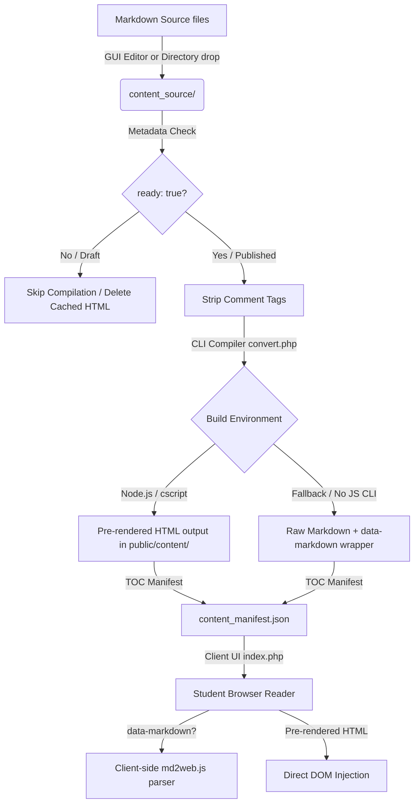

<!--
  Copyright (c) 2026:
  vatofichor - Sebastian Mass     [>_<]
  & Assisted By Gemini Antigravity \|\
-->

# CMS & Content Authoring Specification

This document details the architecture, authoring workflow, metadata schemas, and compiler pipeline used within the `simple-course-explorer` content management system. It serves as a guide for content developers, course administrators, and developers maintaining the publishing pipeline.

---

## 1. Architectural Overview

The Course Explorer operates on a **Flat-File Markdown-to-HTML Static Site Generation (SSG)** paradigm, featuring a secure retro-styled GUI admin dashboard. 



---

## 2. Source Content Directory Structure (`content_source/`)

Course materials are organized into numeric-prefixed "Working Set" subdirectories representing course modules or sections. 
Files within these sections are compiled and ordered based on their alphabetical file names.

```
content_source/
├── 01_Basics/
│   ├── 01_Introduction.md   <-- Source Markdown (published/ready)
│   ├── 02_Alphabets.md      <-- Source Markdown (draft/hidden)
│   └── chart.png            <-- Asset file synced by compiler
└── 02_Nouns/
    ├── 01_Declension.md
    └── table.jpg
```

---

## 3. Metadata Comment Tags

Lessons use HTML comment tags at the very beginning of the Markdown file to communicate state and metadata to the compiler and the client.

| Tag | Options | Default | Purpose |
| :--- | :--- | :--- | :--- |
| `<!-- ready: [bool] -->` | `true`, `false` | `false` | Controls lesson visibility. Unready (draft) files are not compiled and are excluded from the course manifest. |
| `<!-- ai-generated: [bool] -->` | `true`, `false` | `true` | Flags the lesson as AI-Generated. Renders a standard contributor/assistance disclaimer badge in the student view. |
| `<!-- contributors: [string] -->` | Comma-separated names | *(Empty)* | Names of human editors who reviewed or updated the page. Displays as a credit badge in the student view. |

> [!IMPORTANT]
> **Metadata Tag Precedence**: Metadata tags must be declared at the absolute beginning of the Markdown source document to ensure they are stripped correctly before the Markdown file is parsed by the engine.

---

## 4. GUI Administration Panel

The admin environment is accessible via `/admin/dashboard.php` and is protected by session-based credentials.

### Dashboard (`admin/dashboard.php`)
- Lists all discovered sections and lessons from `content_source/`.
- Highlights drafts, AI-generated pages, and contributor lists.
- Features a **Manual Rebuild** control to force compile the static database.

### Create Lesson (`admin/new_page.php`)
- **Target Section**: Discovers directories inside `content_source/`.
- **Order Prefix**: Numeric formatting (e.g. `01`, `02`) to handle page sequencing.
- **Ready/Published State**: Default unchecked (draft status) for work in progress.
- **Submit**: Prepends metadata block, writes file to disk, and triggers rebuild.

### Page Editor & Previewer (`admin/edit_page.php`)
- **Dual-Pane Layout**: Retro high-density code editor on the left with live, real-time client-side HTML preview rendering on the right.
- **Section Assets Manager**: Drag-and-drop or select uploader that saves assets (images, PDFs, media) directly in the active section folder.
  - Clicking any item in the assets list instantly inserts the appropriate markdown syntax (e.g. ``) at the text cursor position.
  - Media assets are synchronized to the student view folders immediately.

---

## 5. Compilation Pipeline (`convert.php`)

The compiler script ([convert.php](file:///d:/Dev/_PLUGIN-DEV/simple-course-explorer/dev/admin_scripts/convert.php)) traversal logic runs in four distinct stages:

### Step 1: Scan and Media Sync
The compiler runs recursively through `content_source/`. Non-markdown files (images, audio, video, PDFs) are synchronized to the corresponding `public/content/` directory if they are new or modified.

### Step 2: Metadata Check & Draft Deletion
If a markdown file lacks `<!-- ready: true -->`:
- It is classified as a draft.
- The compiler deletes any compiled HTML matching the path from `public/content/`.
- It skips compilation and does not add the file to the manifest array.

### Step 3: Parse and Compile (Primary vs. Fallback Paths)
If `ready: true`, the compiler strips the metadata headers (preventing raw comment strings from leaking into structural HTML paragraphs) and builds:

#### A. Primary Path (Server-Side Compile)
Executes `md2web.js` via command line using local Node.js or Windows Script Host (`cscript`).
* Result: Pre-rendered static HTML saved in `public/content/[Section]/[Lesson].html`.
* Wrapper: Wrapped in `<article data-generated="true" data-modified="Contributor Name">` tags.

#### B. Fallback Path (Dynamic Client-Side Compile)
Triggered if command-line execution fails or if no local JS environments exist:
* Result: A raw markdown body wrapped in a `<article data-markdown="true">` container saved on disk.
* Client action: When the student opens this page, the client-side app detects `data-markdown="true"`, feeds the raw text to browser-side `md2web.js`, and parses the HTML dynamically.

### Step 4: Manifest Writing
Registers all published files in `public/content/content_manifest.json` with the following structure:
```json
[
    {
        "relative_path": "01_Basics/01_Introduction.html",
        "title": "Introduction to the Course",
        "order": 0,
        "section": "01_Basics"
    }
]
```

---

## 6. Troubleshooting and Operations Guide

### Q: Why isn't a new lesson showing up in the explorer sidebar?
**A:** Check that the lesson has the **Ready / Published** checkbox selected in the editor. Also, check that the compiler executed successfully (you should see `Compiled: ...` or `Draft skipped: ...` in the execution output).

### Q: Why do my markdown comments appear wrapped in `<p>` tags?
**A:** This occurs if comment tags are separated by single newlines from structural headings or body paragraphs. Pre-compilation comment stripping in `convert.php` strips them prior to parser execution, but manual Markdown edits outside of the GUI should leave double newlines (`\n\n`) between comments and content tags to avoid parser layout wrapping conflicts.

### Q: How do I force compile the course from a terminal?
**A:** Run the PHP build CLI driver directly:
```bash
php dev/admin_scripts/convert.php
```
