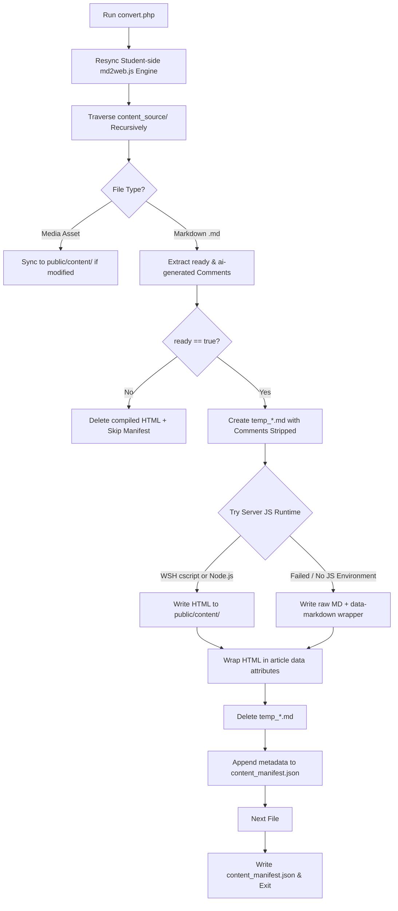

<!--
  Copyright (c) 2026:
  vatofichor - Sebastian Mass     [>_<]
  & Assisted By Gemini Antigravity \|\
-->

# Compiler Pipeline & Build Specification (`convert.php`)

This specification details the implementation mechanics, runtime environment detection, asset synchronization routines, and fallback behaviors of the Course Explorer compiler suite driven by [convert.php](file:///d:/Dev/_PLUGIN-DEV/simple-course-explorer/dev/admin_scripts/convert.php).

---

## 1. System Role & Lifecycle

The compiler pipeline acts as the bridge between raw, author-edited Markdown documents in `/content_source/` and the compiled static site assets distributed under `/public/content/`. It is triggered:
1. **Automatically**: Upon page updates, section creation, or asset uploads in the GUI editor (`edit_page.php` and `new_page.php`) via PHP background execution.
2. **Manually**: By administrators via the dashboard GUI control or direct CLI execution.

---

## 2. Compilation Flow & Steps



---

## 3. Detailed Component Mechanics

### A. Core Engine Sync
At start, `convert.php` ensures the student-side browser runtime engine remains synchronized with any backend updates by copying `/lib/md2web-plugin/md2web.js` directly to `/public/res/lib/md2web.js`.

### B. Recursive Directory Scanner & Asset Sync
The compiler runs a custom recursive scanner `getMarkdownFiles()` to extract all content entries:
- **Media Asset Sync**: Identifies media files (`.png`, `.jpg`, `.jpeg`, `.gif`, `.webp`, `.svg`, `.pdf`, `.mp3`, `.mp4`). If the source file is newer than the public destination file or the destination does not exist, the file is copied to keep the public content directory fully populated.
- **Markdown Sorting**: Discovered `.md` files are sorted alphabetically by their full relative paths. This preserves sequence sorting (e.g. `01_Intro.md`, `02_Basics.md`) across all compiled indices.

### C. Pre-Processing Comment Stripping
Because the `md2web.js` compilerGroups adjacent text into paragraphs before stripping comments, comments at the very beginning of the document can cause paragraph-wrapping conflicts in the HTML output.
1. The compiler creates a temporary file prefixed with `temp_` in the target subdirectory.
2. It strips all metadata comment blocks using regex:
   ```php
   $mdContentClean = preg_replace('/<!--\s*(ready|contributors|ai-generated):\s*(.+?)\s*-->\s*/i', '', $mdContent);
   ```
3. The clean temporary file is processed by the compiler wrapper, and deleted immediately after compilation.

### D. Environment-Aware Execution Profiles
The compiler dynamically detects the host operating system and shell interpreters to choose the most efficient JS runtime:

| Target Host OS | Primary Runtime | Fallback Runtime | Command Executed |
| :--- | :--- | :--- | :--- |
| **Windows** | Windows Script Host (`cscript`) | Node.js (`node`) | `cscript /Nologo md2web.js [src] [dest] [rel]` |
| **Unix / macOS** | Node.js (`node`) | PHP Text Fallback | `node md2web.js [src] [dest] [rel]` |

### E. Static Compilation vs. Fallback Dynamic Parsing
If execution of both `cscript` and `node` fails (due to shared hosting permission constraints or missing runtimes), the compiler activates the **Dynamic Fallback Pattern**:
1. **Fallback Generation**: The compiler generates an HTML output wrapper, placing the raw Markdown body inside it:
   ```html
   <article data-markdown="true" data-generated="true">
   # Page Title
   Raw Markdown Body...
   </article>
   ```
2. **Client-Side Parsing**: When the student browser requests the page, the client application recognizes the `data-markdown` attribute and executes client-side `md2web.js` to render the content on the fly.

### F. Article Wrapper Decoration
For pre-rendered HTML compiled successfully on the server, the compiler wraps the output in standard semantic article containers decorated with authoring metadata:
```html
<article data-generated="true" data-modified="John Doe, Sarah Jenkins">
    <h1>Page Title</h1>
    <p>Pre-rendered static HTML content...</p>
</article>
```

---

## 4. Manifest Registry Configuration

After scanning and processing all lessons, the manifest array is sorted and saved to `/public/content/content_manifest.json`. Draft pages are fully excluded:

```json
[
  {
    "relative_path": "01_Basics/01_Introduction.html",
    "title": "Introduction to Koine",
    "order": 0,
    "section": "01_Basics"
  },
  {
    "relative_path": "02_Nouns/01_Declension.html",
    "title": "The First Declension",
    "order": 1,
    "section": "02_Nouns"
  }
]
```

---

## 5. CLI Output Messages & Diagnostics

When executed via command line, `convert.php` provides diagnostic output:

- **Skipping Draft**:
  `Draft skipped: 01_Basics/02_Draft.md (deleted from public if existed)`
- **Compilation Success**:
  `Compiled: 02_Nouns/01_Declension.md -> 02_Nouns/01_Declension.html`
- **Manifest Synchronization**:
  `Manifest updated.`
  `Rebuild complete!`
